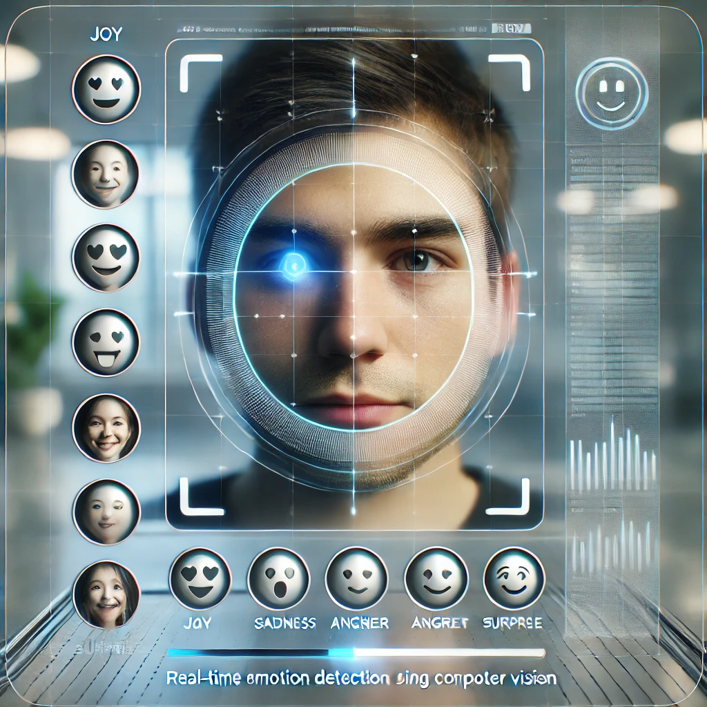

# MoodEye



## Description du Projet
**MoodEye** est une application de vision par ordinateur destinée à détecter et analyser en temps réel les émotions d'une personne en se basant sur les expressions faciales. Ce projet utilise des techniques de traitement d'images et d'apprentissage profond pour capturer des émotions telles que la joie, la tristesse, la colère, la surprise, et bien plus encore. MoodEye est conçu pour être appliqué dans des domaines tels que l'assistance client, les enquêtes de satisfaction, les études de comportement en ligne et le bien-être émotionnel.

## Objectif du Projet
Le but de **MoodEye** est de proposer une solution performante et précise pour reconnaître un large éventail d’émotions humaines en temps réel, grâce aux techniques avancées de vision par ordinateur. Cette technologie peut être utilisée dans les applications commerciales, éducatives et de recherche.

## Contributeurs
- **Osama Rahim** - Développement des modules de détection faciale et de suivi des points clés
- **Yassine Mernissi** - Conception du module de reconnaissance des émotions et optimisation du pipeline

## Dates du Projet
Début : 25 decembre 2024  
Fin : 8 janvier 2025 

## Contexte
Avec l’essor de l’intelligence artificielle et traitement flux vidéo, la reconnaissance des émotions à partir des expressions faciales est devenue un champ d'étude majeur, offrant des applications variées allant de la santé mentale aux interactions automatisées avec les clients. MoodEye vise à répondre à ces besoins par une solution légère, rapide et précise, accessible à divers secteurs.

## Motivation
Comprendre les émotions en temps réel ouvre la voie à des expériences interactives et empathiques dans le numérique. MoodEye permet d’allier technologie et intelligence émotionnelle, en offrant une solution capable de capter des micro-expressions et de fournir une analyse émotionnelle fiable pour des interactions humaines améliorées.

## Objectifs Spécifiques
1. **Détection faciale en temps réel** : Identifier et suivre avec précision les traits du visage malgré les variations d’angles ou d’expressions.
2. **Classification des émotions** : Reconnaître et classifier un éventail d'émotions comme la joie, la tristesse, la colère, la surprise, et d'autres encore.
3. **Suivi de l’évolution émotionnelle** : Analyser les changements émotionnels dans le temps pour obtenir une vue complète de l’expérience émotionnelle d’un individu.
4. **Optimisation pour le temps réel** : Réduire la latence pour garantir une fluidité et une précision optimales, même sur des appareils aux capacités limitées.

## Technologies Utilisées
- **Langage** : Python (compatible avec Python 3.7+)
- **Bibliothèques principales** :
  - **OpenCV** : Pour le traitement d'images en temps réel
  - **Dlib** : Détection faciale et suivi des points clés
  - **FER** : Bibliothèque de reconnaissance d'émotions
  - **TensorFlow / PyTorch** : Entraînement et gestion des modèles de classification d’émotions
- **Plateformes Cibles** : Systèmes de bureau et mobiles

## Organisation et Calendrier du Projet
Le projet est organisé en plusieurs phases, avec des dates spécifiques pour chaque étape afin de garantir un suivi efficace.

| Étape                          | Début     | Fin       | Durée (jours) |
|--------------------------------|-----------|-----------|---------------|
| Initialisation et Planification| 25 dec.   | 26 nov.   | 2             |
| Préparation des Données        | 26 dec.   | 31 nov.   | 3             |
| Détection Faciale et Suivi     | 31 dec.   | 1 janv.   | 2             |
| Développement du Classificateur d’Émotions | 1 janv. | 5 janv. | 4     |
| Intégration et Optimisation    | 5 janv.   | 7 janv.   | 2              |
| Tests et Validation Finale     | 7 janv.   | 8 janv.   | 2             |

## Éléments Clés du Projet
1. **Détection Faciale et Suivi des Points Clés** : Détecter et suivre les points du visage afin de garantir une précision élevée dans l’analyse des émotions.
2. **Classification des Émotions** : Utiliser des algorithmes de machine learning pour classer les émotions en fonction des micro-expressions faciales.
3. **Optimisation de la Latence** : Réduire la latence au minimum pour des résultats en temps réel, y compris sur des appareils moins performants.

## Livrables du Projet
1. **Code Source Complet** : Code structuré et documenté dans les répertoires du projet (`src/` et `tests/`).
2. **Documentation** : Comprend un manuel d’utilisation, des guides de développeurs et une documentation API (`docs/`).
3. **Fichiers de Configuration et de Dépendances** : `requirements.txt`, `config.yaml`, pour assurer la reproductibilité du projet.
4. **Présentation Finale** : Inclut les objectifs, étapes de développement, résultats obtenus et propositions d’amélioration.
5. **Lien vers le projet** : [https://github.com/osama782rh/MoodEye](https://github.com/osama782rh/MoodEye)

## Arborescence du Projet

```plaintext
MoodEye/
├── data/
│   ├── raw/                        # Données brutes (images, vidéos)
│   ├── processed/                  # Données pré-traitées (redimensionnées, normalisées)
│   └── examples/                   # Exemples de sorties pour la démo
├── docs/
│   ├── project_plan.md             # Plan de projet, objectifs, feuille de route
│   ├── usage_guide.md              # Guide d'utilisation pour les utilisateurs
│   └── api_documentation.md        # Documentation API (si nécessaire)
├── src/
│   ├── config/
│   │   ├── config.yaml             # Configuration principale du projet (fichiers, hyperparamètres, etc.)
│   │   └── logging_config.yaml     # Configuration du système de logs
│   ├── preprocessing/
│   │   ├── data_loader.py          # Chargement et gestion des jeux de données
│   │   └── data_augmentation.py    # Méthodes pour augmenter et prétraiter les images
│   ├── detection/
│   │   ├── face_detection.py       # Détection faciale avec OpenCV/Dlib
│   │   ├── keypoints_detection.py  # Détection et suivi des points clés du visage
│   └── emotion_detection/
│       ├── emotion_classifier.py   # Classificateur d’émotions basé sur les expressions faciales
│       └── emotion_tracker.py      # Module pour suivre les émotions détectées au fil du temps
│   ├── utils/
│   │   ├── logger.py               # Configuration du système de logs
│   │   ├── metrics.py              # Calcul des métriques de performance
│   │   └── visualizer.py           # Fonctions d'affichage pour visualiser les sorties
│   ├── main.py                     # Point d’entrée du projet
│   └── app.py                      # Interface utilisateur principale pour les tests
├── tests/
│   ├── test_data_loader.py         # Tests pour le chargement des données
│   ├── test_emotion_detection.py   # Tests unitaires de détection d’émotions
│   ├── test_detection.py           # Tests pour la détection et le suivi des points clés
├── notebooks/
│   ├── exploratory_analysis.ipynb  # Analyse exploratoire des données
│   ├── model_training.ipynb        # Notebook pour l'entraînement du modèle de détection
│   └── results_visualization.ipynb # Visualisation des résultats
├── requirements.txt                # Liste des dépendances Python
├── README.md                       # Documentation générale du projet
└── setup.py                        # Script pour l’installation du package Python
